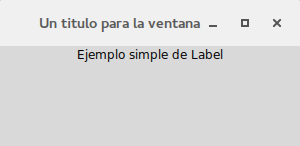

Label
=====

Para comenzar a llenar esa vacía ventana que acabamos de crear vamos a nombrar a las etiquetas o mas conocidas como
*'label'* por su nombre en ingles, las podemos encontrar desde interfaces gráficas hasta en formularios en HTML y son
sumamente útiles en la construcción de interfaces y formularios, al igual que cuando creamos nuestra ventana vacía
declarándola de la siguiente forma *"root = Tkinter.Tk()"* tendremos que hacerlo con nuestra etiqueta, para esto
necesitamos escoger un nombre en mi caso escogeré **"etiqueta"** para declararla y deberemos llamar al widget "Label"
en vez de la función "Tk" como habíamos hecho anteriormente, como para orientarnos con lo ya visto quedando por ahora
algo así:

.. code-block:: python

    etiqueta = Tkinter.Label()

Una vez creada la estructura básica de la etiqueta, tendremos que llenar esa paréntesis. Primero tendremos que indicar
a donde pertenece ese 'label' indicando el identificador de la ventana que en nuestro caso es 'root', separado por una
coma escribiremos lo siguiente **text=** en donde seguido del signo igual incluiremos el texto que deseamos que incluya
la etiqueta, la cual puede ser un texto (que tendremos que encerrar entre comillas al igual que cuando usamos la
sentencia print) o una variable que contenga al texto. Para verlo un poco mas claro juntemos todo en dos ejemplos,
uno donde muestre un texto fijo que le indiquemos a la etiqueta y otro usando una variable

- **Ejemplo numero 1**:

.. code-block:: python

    etiqueta = Tkinter.Label(root, text="Probando Label")

- **Ejemplo numero 2**:

.. code-block:: python

    import getpass
    texto = "Bienvenido %s a nuestra guia:\t" % getpass.getuser()
    etiqueta_2 = Tkinter.Label(root, text=texto)

Expliquemos los dos ejemplos, en el primero usamos un texto fijo no dinámico para utilizar como valor de la etiqueta
en cambio en el segundo estamos usando una variable en donde su valor varia dependiendo de la salida que obtengamos al
ejecutar *'getpass.getuser()'* que obtiene el nombre de usuario que tengamos en nuestra PC, como podemos observar su
funcionamiento no varia mucho de lo que nos tiene acostumbrados Python, así que manejarnos con Tkinter es solamente
aprendernos un par de nombres de sus widgets como para poder empezar a utilizarlo, el resto sigue siendo código Python.

Pero (siempre hay un pero) antes de poder ejecutar este ejemplo en nuestra consola tendremos que declarar este widget
en nuestra ventana dándole una ubicación en la misma, sino hacemos esto nuestra etiqueta simplemente no aparecerá en
nuestra ventana, va a existir pero no se visualizara. Para hacerlo tenemos tres formas (Esto se vera mas detenidamente
mas adelante) una es usando **'pack'** y las otras dos son **'grid'** y **'place'**. Como esto se vera mas adelante
haré una breve síntesis de las tres opciones que tenemos:

.. todo:: Escribir sintesis

- 'pack':

- 'grid':

- 'place:

Como en este ejemplo solo colocaremos una etiqueta no es necesario recurrir al uso de 'grid' para posicionarlo, así que
usaremos 'pack' en su lugar. Pero lo mas importante es saber como se declara esta etiqueta en nuestra ventana y poder
ver nuestro primer widget en funcionamiento, para lograr esto deberemos usar la siguiente forma:

.. code-block:: python

    etiqueta.pack()

Como vemos es muy simple solo debemos usar el nombre que utilizamos para declarar nuestra etiqueta seguida de la forma
que vayamos a utilizar para posicionarla, pero para los que no desean esperar a leer la siguiente sección para ver como
se utiliza 'grid' les dejo la misma etiqueta pero posicionándola con 'grid' en lugar de usar 'pack' como ya lo habíamos
visto:

.. code-block:: python

    etiqueta.grid(row=1, column=1)

Como se puede observar esta otra forma debimos indicarle dos parámetros que sirven para especificar la posición del
widget, en este caso nuestra etiqueta. El primer parámetro es *'row'* que se traduce como fila al español y el segundo
es *'column'* o columna en español con ellos podemos indicar en que columna y fila deberá colocarse el widget, aunque
por ahora no profundizaremos entrando en detalles en la forma que trabaja cada uno ni todos los parámetros que acepta
cada una.

Si ahora escribiéramos todo lo que vimos en nuestra consola tendríamos que ver nuestra primera etiqueta en
funcionamiento, contenido dentro de una ventana quedando todo el código como el siguiente:

.. code-block:: python
    :linenos:

    from six.moves import tkinter as tk

    class UI(tk.Frame):
        """Docstring."""

        def __init__(self, parent=None):
            tk.Frame.__init__(self, parent)
            self.parent = parent
            self.init_ui()

        def init_ui(self):
            """Aqui colocariamos los widgets."""
            self.parent.title("Un titulo para la ventana")

            etiqueta = tk.Label(self.parent, text="Ejemplo simple de Label")
            etiqueta.pack()

    if __name__ == "__main__":
        ROOT = tk.Tk()
        ROOT.geometry("300x100")
        APP = UI(parent=ROOT)
        APP.mainloop()
        ROOT.destroy()

Y así es como quedara nuestro ejemplo terminado:

Habiendo ya escrito esas lineas se da por finalizada la muestra de este primer widget, pero antes veamos algunos
métodos que tenemos disponibles.

Métodos
-------

.. py:method:: cget(option)

    :param option: El valor de la opcion a consultar.
    :type option: str

    :return: Devuelve la cadena con el valor de la opcion consultada
    :rtype: str

    :raises TclError: si no existe la opcion
    :raises TypeError: si no se pasa una opcion

Este método nos permite obtener el valor de determinada opción pasada al widget, supongamos que deseamos obtener el
color de fondo (background) o el tipo de borde (relief) que tiene, para esto contamos con 'cget' el cual pasandole como
una cadena el nombre de la opción nos devuelve su valor.

Por ejemplo si sobre nuestro widget llamáramos al método 'cget' con los siguientes argumentos veríamos algo así:

.. code-block:: bash

    >>> etiqueta = tk.Label(self.parent, text="Ejemplo simple de Label")
    >>> etiqueta.cget('background')
    '#d9d9d9'
    >>> etiqueta.cget('relief')
    'flat'
    >>> etiqueta.cget('text')
    'Ejemplo simple de Label'

Así funcionaria de la misma forma para todas las opciones soportadas por el widget.

.. todo:: Mejorar uso de Sphinx (http://sphinx-doc.org/domains.html#the-python-domain)

.. py:method:: configure()

    :return: Listado completo de las opciones y sus configuraciones disponibles
    :rtype: dict

.. py:method:: configure(option)

    :param option: Opcion a consultar
    :type option: str

    :return: Devuelve la configuracion para la opcion pasada
    :rtype: tuple

.. py:method:: configure({option:value})

    :param option: Diccionario con las opciones a modificar
    :type option: dict

    :rtype: None

.. TODO: Tocar este metodo en parte avanzada de la guia

El metodo *configure* es muy potente y hace de extension de *cget*, con el podemos obtener un valor si le pasamos como
cadena la opcion a consultar al igual como lo hace *cget*, pero lo hace devolviendo una tupla con mas informacion, mas
adelante en una seccion avanzada de la guia lo veremos mas detalladamente.

Si no pasamos un argumento nos mostrara los valores de todas las opciones existentes.

Por ultimo podemos pasarle un diccionario con una o mas opciones como llaves con los valores a establecer, a continuacion
se muestra un ejemplo para cambiar el color de fondo de la etiqueta.

.. code-block:: bash

    >>> etiqueta.cget('background')
    '#d9d9d9'
    >>> etiqueta.configure('background')
    ('background', 'background', 'Background', <border object at 0x559d5b771410>, '#d9d9d9')
    >>> etiqueta.configure({'background': '#ccc'})
    >>> etiqueta.cget('background')
    '#ccc'
    >>> etiqueta.configure()
    {'highlightthickness': ('highlightthickness', 'highlightThickness', 'HighlightThickness', <pixel object at 0x559d5b7f63d0>, <pixel object at 0x559d5b7f63d0>),
    'text': ('text', 'text', 'Text', '', 'Ejemplo simple de Label'),
    'image': ('image', 'image', 'Image', '', ''),
    'compound': ('compound', 'compound', 'Compound', <index object at 0x559d5b771980>, 'none'),
    ...
