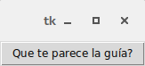
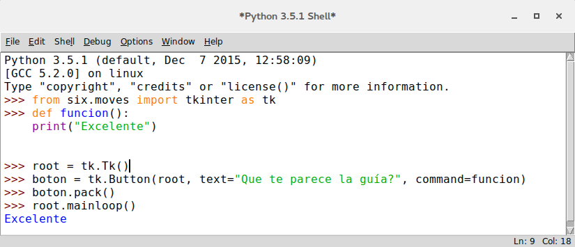

.. _button:

Botones [Button]
================

Los botones pueden contener texto o imágenes y se les puede asociar funciones o métodos, que al hacer clic sobre ellos
Tkinter se encargara de llamar automáticamente a ese método o función y ejecutara el código Python contenido dentro de
ellos.

Un detalle es que solo puede utilizarse un tipo de fuente, pero ese texto puede ocupar varias lineas en caso de ser
necesario. Además se puede subrayar el texto, un carácter o letra en particular, algo que es muy común cuando se desea
decirle al usuario sobre la existencia de un atajo con el teclado.

Antes de crear a ese botón debemos declarar la función a la cual se llamara, porque como se imaginaran no podemos
decirle al botón que ejecute una función que no existe, por eso vamos a escribir un par de lineas y crearemos una
función simple como para verificar que dicho botón funciona correctamente.

.. code-block:: python

    def función():
      print "Excelente"

Con esas dos lineas nos va a servir para demostrar su funcionamiento, ahora si vamos por el botón.

A continuación les muestro el código con el cual vamos a trabajar:

.. code-block:: python
    :linenos:

    from six.moves import tkinter as tk

    def funcion():
        print("Excelente")

    root = tk.Tk()
    boton = tk.Button(root, text="Que te parece la guía?", command=funcion)
    boton.pack()
    root.mainloop()

En el se observa la ya conocida importación del modulo Tkinter, la función que ya habíamos declarado y la creación del
botón. Como se puede ver la creación de un botón básico es muy similar al de una etiqueta pero se incluye un parámetro
mas que nos dará la posibilidad de especificar dentro de el la función que utilizaremos; el parámetro mencionado es
**'command'** y en el podemos llamar a funciones o métodos, en este caso llamamos a la función 'función' que va a
imprimir en la consola la palabra *'Excelente'*.

    Boton basico

    Comando basico en un boton

Métodos
-------

.. _cget-button-method:

cget
^^^^

Este método cumple la misma función que se vio en el widget :ref:`Label <label>`. :ref:`Ver aqui <cget-method>`.

.. _configure-button-method:

configure
^^^^^^^^^

Este método cumple la misma función que se vio en el widget :ref:`Label <label>`. :ref:`Ver aqui <configure-method>`.

.. _invoke-button-method:

invoke
^^^^^^

.. py:method:: invoke()

    :return: Devuelve valor de retorno de la funcion asociada a metodo *command*
    :rtype: srt or None

Este método invoca al comando asociado al botón, El valor que retorna es el valor de retorno del comando o una cadena
vacía en caso de no existir un comando asociado. En caso de que el botón se encuentre desactivado este método se ignora.

.. code-block:: bash

    >>> from six.moves import tkinter as tk
    >>> def funcion():
    ...     print("Excelente guia")
    ...
    >>> root = tk.Tk()
    >>> boton = tk.Button(root, text="Probando el boton", command=funcion)
    >>> boton.pack()
    >>> boton.invoke()
    Excelente guia
    'None'
    >>>

.. code-block:: bash

    >>> from six.moves import tkinter as tk
    >>> def funcion():
    ...     return "Excelente guia"
    ...
    >>> root = tk.Tk()
    >>> boton = tk.Button(root, text="Probando el boton", command=funcion)
    >>> boton.pack()
    >>> boton.invoke()
    Excelente guia
    >>>

.. code-block:: bash

    >>> from six.moves import tkinter as tk
    >>> root = tk.Tk()
    >>> boton = tk.Button(root, text="Probando el boton")
    >>> boton.pack()
    >>> boton.invoke()
    ''
    >>>
