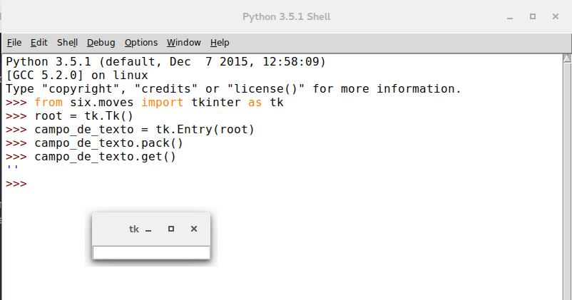
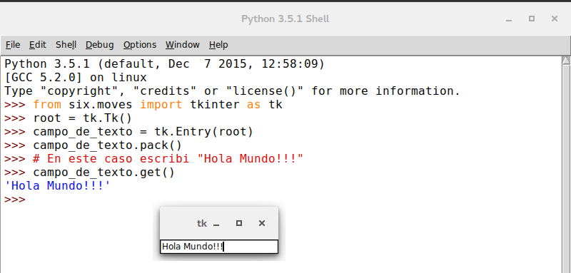

.. _entry:

Cuadro de texto [Entry]
=======================

.. todo:: Enlazar con seccion options

Este widget nos permite tanto mostrarle información al usuario como también obtenerla de su parte, dotando a nuestra
ventana de un widget muy poderoso y útil, siendo el primero de los widgets mencionados que nos posibilitara la
interacción del usuario solicitando la entrada de datos. Como venimos haciendo en esta guía se mostraran algunos
conceptos básicos que te permitirán empezar a utilizarlo, pero luego en la sección 'Opciones' se detallan las opciones
que tienen disponibles al crear un cuadro de texto.

Este elemento es muy popular y sumamente útil así que deberemos de conocerlo y manejarlo, para esto comencemos explicando
algunos conceptos básicos para entender mejor de se trata esto.

Para empezar a utilizar nuestro elemento 'Entry' podemos primero declarar una variable del tipo 'StringVar' o del tipo
'IntVar' (tenemos mas opciones disponibles pero se verán mas detenidamente en otra sección), estas variables capturan
el texto que el usuario ingrese en el cuadro para luego poder trabajar con esos datos, aunque esta practica es muy
recomendada y hasta imprescindible en ocasiones, no es un requisito obligatorio para utilizar nuestro cuadro de texto
como es visto en algunos sitios web.

Por esto veremos primero un uso mas básico para luego entrar mas en detalle e incorporar estas variables a nuestro
repertorio.

La forma en que se declara un cuadro de texto es muy simple:

.. code-block:: python

    campo_de_texto = tk.Entry(root)

Esa es su forma mas básica en donde como se observa no se llama a ninguna de las opciones que tenemos disponibles,
antes de ver los métodos que podemos llamar para hacer uso de este widget veamos un ejemplo de su uso

.. code-block:: bash

    >>> from six.moves import tkinter as tk
    >>> root = tk.Tk()
    >>> campo_de_texto = tk.Entry(root)
    >>> campo_de_texto.pack()
    >>> campo_de_texto.get()
    ''
    >>>

    Ejemplo basico de Entry devolviendo una cadena vacia

Si escribiéramos un texto en el cuadro y escribimos en la consola lo siguiente

.. code-block:: python

    campo_de_texto.get()

estaríamos usando el método 'get' del widget Entry que nos permite obtener el texto que contenga el cuadro de texto,
como podemos observar en el siguiente ejemplo

.. code-block:: bash

    >>> from six.moves import tkinter as tk
    >>> root = tk.Tk()
    >>> campo_de_texto = tk.Entry(root)
    >>> campo_de_texto.pack()
    >>> # En este caso escribi "Hola Mundo!!!"
    >>> campo_de_texto.get()
    'Hola Mundo!!!'
    >>>

    Ejemplo de como obtener texto con el metodo **get**

Seguramente ese rectángulo en nuestra ventana de poco serviría si no pudiésemos interactuar con este. A continuación
veremos los métodos a lo podemos llamar para trabajar con este widget.

Una observación que se debe hacer, es que para escribir varias lineas de texto se debe utilizar el widget 'Text' que
esta pensado para esto, que sera visto mas adelante.

.. _entry_index:

Índices
-------

Un concepto que hay que tener en cuenta antes de empezar a utilizar algunos métodos disponibles para 'Entry' son los
índices, estos nos facilitan el insertado y eliminado de caracteres entre otras cosas, estableciendo desde y hasta donde
deseamos por ejemplo borrar o insertar texto en el cuadro de texto. Para conseguir esto contamos con varias formas que
las iremos viendo de a una para luego verlas dentro de los métodos que las soportan y ya con unos ejemplos para afianzar
los conocimientos.

Índices numéricos
^^^^^^^^^^^^^^^^^

Estos funcionan como los índices de las listas de Python así que su aplicación no debería ser complicada, el primer
carácter comenzara a contar desde 0 en adelante. Para mas referencia repase los conceptos básicos de listas y tuplas en
Python.

ANCHOR
^^^^^^

.. todo:: Enlazar con metodos select_from y select_adjust

Este índice corresponde al inicio del texto que se encuentre seleccionado, en caso de existir un texto seleccionado.
Se puede usar select_from y select_adjust para alterar el comportamiento del mismo.

END
^^^

También podemos marcar desde un determinado carácter hasta el ultimo sin conocer la cantidad de caracteres que componen
a ese campo de texto, esto es gracias a 'END' que haría de comodín para manejarnos de una forma mas sencilla. El uso de
los índices (0,  END) equivaldría a seleccionar todo el texto disponible.

INSERT
^^^^^^

Este índice corresponde a la posición actual de donde se encuentra el cursor. Este índice se puede trabajar junto con el
método 'icursor' para alterar el lugar del cursor.

Obviamente cuando nos referimos a cursor nos referimos a la barra vertical que nos aparece cuando escribimos no al
cursor del mouse (Ver mas información aquí
`Cursor de texto <http://es.wikipedia.org/wiki/Cursor_%28inform%C3%A1tica%29#Cursor_de_texto>`_).

sel.first y sel.last
^^^^^^^^^^^^^^^^^^^^
Así como vimos opciones para trabajar con índices sobre el texto del cuadro, tenemos dos índices mas específicos que nos
permiten trabajar únicamente con el texto que se encuentre seleccionado.
Con sel.first indicamos que deseamos trabajar con el primer carácter del texto que se encuentre seleccionado y con
sel.last indicamos que deseamos trabajar con el ultimo carácter de la selección.

@number
^^^^^^^

Otras de la posibilidades disponibles es usar la posición del cursor del mouse para indicar el índice.

La forma en que trabaja es a través de la siguiente sintaxis

@x

Donde 'x' es un valor en píxeles con respecto al borde izquierdo del campo de texto. Por ejemplo '@0' indica el carácter
mas a la izquierda del campo del texto.

.. note::

    Una observación que se puede hacer sobre los índices es que pueden usarse abreviaturas de los nombres, por ejemplo
    en vez de usar 'end' se puede utilizar 'e'. Como opinión personal no recomiendo el uso de esta practica ya que puede
    quitar legibilidad al código y generar malas costumbres.

Estos índices nos permiten tener un mayor control sobre sobre los cuadros de texto y lo veremos mas claro en la sección
siguiente cuando veamos los métodos disponibles para este.

.. _entry-methods:

Métodos
-------

Como habíamos comentando cuando estábamos viendo el widget Entry, dijimos que existían métodos que nos permitían
trabajar con este, los cuales iremos viendo a continuación.

.. _bbox-entry-method:

bbox
^^^^

.. todo:: Escribir descripcion

.. _cget-entry-method:

cget
^^^^

Este método cumple la misma función que se vio en el widget :ref:`Label <label>`. :ref:`Ver aqui <cget-method>`.

.. _configure-entry-method:

configure
^^^^^^^^^

Este método cumple la misma función que se vio en el widget :ref:`Label <label>`. :ref:`Ver aqui <configure-method>`.

.. _delete-entry-method:

delete
^^^^^^

.. py:method:: delete(first, last=None)

    :param first: Indica en inicio del indice
    :type first: indice
    :param last: Indica el fin del indice
    :type last: indice

    :rtype: None

Elimina uno o mas elementos del campo de texto, este método recibe dos argumentos uno es el inicio desde donde se desea
eliminar el contenido y el segundo argumento es hasta donde deseamos eliminar, al igual que en Python debemos comenzar
el índice contando desde 0. Por ejemplo para eliminar de la siguiente cadena

'0123456789'

de los caracteres del 0 al 5, los índices que le deberíamos de dar serian (0, 6). Esto no es nada nuevo a lo ya venimos
viendo en este lenguaje de programación.

También podemos pasarle un solo argumento para borrar un solo carácter, veamos estos dos a través de unos ejemplos.

Con un solo argumento:

.. code-block:: bash

    >>> from six.moves import tkinter as tk
    >>> root = tk.Tk()
    >>> campo_de_texto = tk.Entry(root)
    >>> campo_de_texto.pack()
    >>> campo_de_texto.get()
    '0123456789'
    >>> campo_de_texto.delete(0)
    >>> campo_de_texto.get()
    '123456789'
    >>>

Con dos argumentos:

.. code-block:: bash

    >>> from six.moves import tkinter as tk
    >>> root = tk.Tk()
    >>> campo_de_texto = tk.Entry(root)
    >>> campo_de_texto.pack()
    >>> campo_de_texto.get()
    '0123456789'
    >>> campo_de_texto.delete(0, 6)
    >>> campo_de_texto.get()
    '6789'
    >>>

Otra opción que tenemos es borrar desde un inicio fijado por nosotros hasta el final del texto disponible en el campo
de texto gracias a un índice que nos da Tkinter que es 'END', con este podemos de la siguiente forma borrar desde el
inicio hasta el final sin necesitar conocer cuantos caracteres componen el texto contenido en el widget

.. code-block:: python

    campo_de_texto.delete(0, tk.END)

Aunque no es necesario comenzar desde el inicio también podemos borrar desde el quinto carácter hasta el ultimo

.. code-block:: python

    campo_de_texto.delete(5, tk.END)

También podemos utilizar los índices ya vistos en la sección 'Índices'.

.. _get-button-method:

get
^^^

.. py:method:: get()

    :return: Devuelve el texto del campo de texto
    :rtype: str

Obtiene el contenido del campo de texto. Algo muy necesario para nosotros es poder obtener el texto contenido dentro del
campo de texto, para conseguir esto podemos hacernos del método 'get' que nos lo permitirá, este nos retornara el texto
como una cadena. Veamos con un ejemplo escribiendo cualquier texto y llamamos al método 'get'

.. code-block:: bash

    >>> from six.moves import tkinter as tk
    >>> root = tk.Tk()
    >>> campo_de_texto = tk.Entry(root)
    >>> campo_de_texto.pack()
    >>> # Ahora deben escribir el texto
    >>> # en el campo de texto
    >>> campo_de_texto.get()
    'Mostrando el uso de get'
    >>>

El valor que nos retorne siempre sera como una cadena y es muy simple comprobarlo, coloquemos un texto en nuestro campo
de texto, en mi caso escribiré la cadena 'Viva Python!!!' y almacenemos su valor en una variable para luego analizarla.

.. code-block:: bash

  >>> var = campo_de_texto.get()
  >>> var
  'Viva Python!!!'
  >>> isinstance(var, str)
  True
  >>> var = campo_de_texto.get()
  >>> var
  '1'
  >>> isinstance(var, str)
  True
  >>>

Mas adelante veremos como validar nuestros campos de textos.

.. _icursor-button-method:

icursor
^^^^^^^

.. py:method:: icursor(index)

    :param index: Indica donde colocar el cursor
    :type index: indice

    :rtype: None

Nos permite mover el cursor hasta la posición indicada, cuando vimos acerca de los índices vimos a INSERT y mencionamos
a 'icursor'. Este método nos permite cambiar a donde deseamos que cambie la posición del cursor y junto a INSERT podemos
llevar nuestra aplicación a otro nivel de interacción con el usuario.

Un ejemplo simple seria el siguiente

.. code-block:: bash

    >>> entrada.icursor(0)

.. code-block:: bash

    >>> entrada.icursor(tk.END)

Recuerden de haber escrito un texto en el campo y que tenemos a nuestra disposición los índices para indicar la posición
del cursor.

.. _index-button-method:

index
^^^^^

.. py:method:: index(index)

Indica el valor numerico del indice indicado. La utilidad de 'index' esta en que nos permite saber por ejemplo cual es
el indice del ultimo caracter, ya vimos que con END podiamos ir al ultimo caracter del cuadro de texto, pero como saber
cuantos caracteres tiene esa cadena sin recurir a 'len()', ahi entra 'index' que nos permite obtener esos valores.
Aclaremos estos conceptos con unos sencillos ejemplos.

.. code-block:: bash

    >>> campo_de_texto.get()
    'ABCD'
    >>> campo_de_texto.index(tk.END)
    4
    >>>

Ahora probemos poniendo el cursor despues del tercer caracter y veamos si podemos obtener su posicion

.. code-block:: bash

    >>> campo_de_texto.index(tk.INSERT)
    3
    >>>

Asi como funciono con 'end' y 'insert' tambien deberia hacerlo con 'anchor', asi que volvamos a la consola. Para el
primer ejemplo seleccionemos desde el indice 4 al 0, es decir seleccionemos todo el texto de derecha hacia izquierda

.. code-block:: bash

    >>> campo_de_texto.index(tk.ANCHOR)
    4
    >>>

Y ahora hagamos algo similar pero seleccionando de izquierda hacia derecha

.. code-block:: bash

    >>> campo_de_texto.index(tk.ANCHOR)
    0
    >>>

Como vemos pasandole el indice 'anchor' podemos obtener el indice numerico desde donde se inicio la seleccion del texto.

Y como ultimo ejemplo como resultaria logico si le pasamos como argumento un indice numerico nos deberia devolver ese
mismo numero

.. code-block:: bash

    >>> campo_de_texto.index(3)
    3
    >>>

Salvo que le indiquemos un numero mayor a la cantidad de caracteres disponibles, que en ese caso nos devolvera el valor
del ultimo indice

.. code-block:: bash

    >>> campo_de_texto.index(9)
    4
    >>>

.. _insert-button-method:

insert
^^^^^^

.. py:method:: insert(index, string)

    :param index: Indica donde colocar la cadena o caracter
    :type index: indice
    :param string: Cadena o caracter a ingresar
    :type string: str

    :rtype: None

Permite la inserción de texto. Supongamos que necesitamos insertar una cadena, un numero o un carácter en un campo de
texto, para conseguirlo es tan simple como llamar a este método pasándole dos argumentos como parámetros. De los dos
argumentos mencionados uno es el índice de donde deseamos insertar el texto y el segundo es la cadena o caracter.

En este ejemplo insertaremos la cadena "GNU/" desde el índice 0

.. code-block:: bash

    >>> from six.moves import tkinter as tk
    >>> root = tk.Tk()
    >>> campo_de_texto = tk.Entry(root)
    >>> campo_de_texto.pack()
    >>> campo_de_texto.get()
    'Linux'
    >>> campo_de_texto.insert(0, "GNU/")
    >>> campo_de_texto.get()
    'GNU/Linux'
    >>>

.. _xview-button-method:

xview
^^^^^

.. py:method:: xview()

    :return:
    :rtype: tuple

Este comando se utiliza para consultar y cambiar la posición horizontal del texto en la ventana del widget. Puede tomar
cualquiera de las siguientes formas:

.. todo:: Escribir metodo

Validando un campo de texto
---------------------------

Con lo que vimos ahora estamos mas cerca de dominar los cuadros de texto, aunque no hay que apresurarnos que nos queda
mucho camino por delante.

Para referencias acerca de textvariable vea la sección "Variables".

.. todo:: Primero escribir seccion *Variables*
