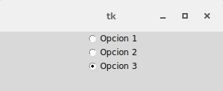

.. _radiobutton:

Botones de opción [Radiobutton]
===============================

Dentro de la familia de los botones acabamos de ver a *Checkbutton* y ahora le toca a *Radiobutton*. Estos dos se
diferencian no solo en su forma sino que en *Radiobutton* solo uno de ellos puede estar seleccionado en la practica
seria una opción cuando tenemos un tipo de selección de uno de muchos. Cada *Radiobutton* puede contener texto e
imágenes y ser asociado a una función o método, que cuando se selección Tkinter llamaría automáticamente a esa función
al igual que como lo haría con un botón.

Para conseguir este comportamiento hay que asegurarse de que todos los *Radiobutton* apunten a la misma variable.

Veamos un ejemplo sencillo para entenderlos un poco mas. Tenemos que tener en cuenta que opciones tendríamos que
pasarles para poder utilizarlos, por un lado un texto o imagen para diferenciarlos y por el otro lado el valor que
tendrían y una variable a la que estuvieran asociados. Como habíamos mencionado la variable debe coincidir en todos los
*Radiobutton* del grupo y un valor único para cada uno. Ahora si pasemos al ejemplo:

.. code-block:: bash

    >>> from six.moves import tkinter as tk
    >>> root = tk.Tk()
    >>> variable = tk.StringVar()
    >>> def prueba():
    ...     print("Se ha elegido la opcion" + variable.get())
    ...
    >>> radiobutton1 = tk.Radiobutton(text="Opcion 1", variable=variable, value=1, command=prueba)
    >>> radiobutton2 = tk.Radiobutton(text="Opcion 2", variable=variable, value=2, command=prueba)
    >>> radiobutton3 = tk.Radiobutton(text="Opcion 3", variable=variable, value=3, command=prueba)
    >>> radiobutton1.pack()
    >>> radiobutton2.pack()
    >>> radiobutton3.pack()
    >>> variable.get()
    ''
    >>> # Ahora iremos seleccionando las distintas opciones
    ...
    >>> Se ha elegido la opcion 1
    Se ha elegido la opcion 2
    Se ha elegido la opcion 3
    >>>

    Ejemplo basico de Radiobutton

Como se habrán dado cuenta solo permite elegir una de las tres opciones, esto es debido a que como se había mencionado
apuntan a la misma variable.

.. _radiobutton-methods:

Métodos
-------

.. _cget-radiobutton-method:

cget
^^^^

Este método cumple la misma función que se vio en el widget :ref:`Label <label>`. :ref:`Ver aqui <cget-method>`.

.. _configure-radiobutton-method:

configure
^^^^^^^^^

Este método cumple la misma función que se vio en el widget :ref:`Label <label>`. :ref:`Ver aqui <configure-method>`.

.. _deselect-radiobutton-method:

deselect
^^^^^^^^

Este método cumple la misma función que se vio en el widget :ref:`Checkbutton <checkbutton>`.
:ref:`Ver aqui <deselect-checkbutton-method>`.

.. _flash-radiobutton-method:

flash
^^^^^

.. _invoke-radiobutton-method:

invoke
^^^^^^

Este método cumple la misma función que se vio en el widget :ref:`Checkbutton <checkbutton>`.
:ref:`Ver aqui <invoke-checkbutton-method>`.

.. _select-radiobutton-method:

select
^^^^^^

Este método cumple la misma función que se vio en el widget :ref:`Checkbutton <checkbutton>`.
:ref:`Ver aqui <select-checkbutton-method>`.
