.. _options:

Opciones
========

Muchos de los widgets que utilizamos y vimos hasta ahora cuentan con opciones, con el fin de no repetir la descripcion
de cada uno de ellos seran vistos uno a uno en esta seccion. Esta seccion no es mas que una traduccion de la
documentacion oficial de Tk sobre la libreria Tkinter con ejemplos e imagenes.

.. todo:: Enlazar con seccion para los colores

.. note::

    Para mas informacion sobre los colores visite la seccion "Colores" que se ve en

Pueden encontrar mas informacion desde la documentacion oficial de Tcl/Tk sobre las opciones estandar
`http://www.tcl.tk/man/tcl8.5/TkCmd/options.htm <http://www.tcl.tk/man/tcl8.5/TkCmd/options.htm>`_

.. _option-activebackground:

activebackground
----------------

Con esta opcion podemos indicar que color de fondo se debera utilizar cuando el cursor del mouse se posicione sobre el
widget. Para algunos elementos y en algunas plataformas solo sera visible cuando se hace click sobre el.

Acepta cualquier color en un formato valido para Tk, ver en seccion "Colores"

.. code-block:: python

    boton = Tkinter.Button(root, text="Hola Mundo!!!", activebackground="#F50743")
    boton.pack()

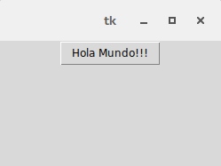

    Ejemplo sin el cursor encima

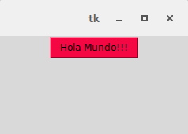

    Ejemplo con el cursor encima

    Se muestra con color '#F50743' (Rojo)

.. _option-activeforeground:

activeforeground
----------------

Al igual que pasa con 'activebackground' con esta otra opcion podemos especificar el color en este caso de la fuente del
widget cuando se posiciona el cursor sobre este.

.. code-block:: python

    boton = tk.Button(root, text="Hola Mundo!!!", activeforeground="#F50743")

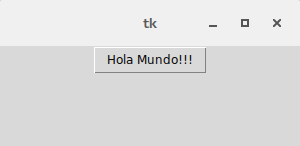

    Ejemplo sin el cursor encima

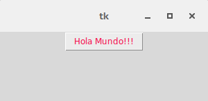

    Ejemplo con el cursor encima

    Se muestra con color '#F50743' (Rojo)

.. _option-anchor:

anchor
------

Tkinter nos permite controlar de que forma se va a posicionar un texto o imagen con respecto al widget en el que se
encuentra. La opcion por defecto es 'CENTER' que muestra el elemento centrado.

  +----+----------+-------+
  | NW |  N       |    NE |
  +----+----------+-------+
  | W  |  CENTER  |    E  |
  +----+----------+-------+
  | SW |  S       |    SE |
  +----+----------+-------+

.. _option-anchor-nw:

NW
^^

Posiciona el texto/imagen en la esquina superior izquierda del widget

.. code-block:: python

    boton = tk.Button(root, text="Hola Mundo!!!", width=20, height=10, anchor="nw")

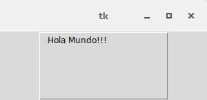

.. _option-anchor-n:

N
^

Posiciona el texto/imagen en la parte superior del widget

.. code-block:: python

    boton = tk.Button(root, text="Hola Mundo!!!", width=20, height=10, anchor="n")

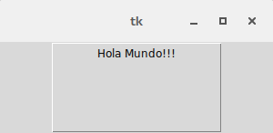

.. _option-anchor-ne:

NE
^^

Posiciona el texto/imagen en la esquina superior derecha del widget

.. code-block:: python

    boton = tk.Button(root, text="Hola Mundo!!!", width=20, height=10, anchor="ne")

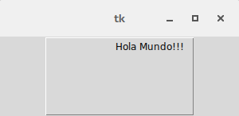

.. _option-anchor-w:

W
^

Posiciona el texto/imagen en la parte izquierda del widget

.. code-block:: python

    boton = tk.Button(root, text="Hola Mundo!!!", width=20, height=10, anchor="w")

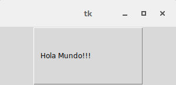

.. _option-anchor-center:

CENTER
^^^^^^

Posiciona el texto/imagen en el centro del widget

.. code-block:: python

    boton = tk.Button(root, text="Hola Mundo!!!", width=20, height=10, anchor="center")

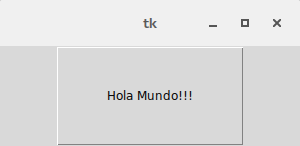

.. _option-anchor-e:

E
^

Posiciona el texto/imagen en la parte derecha del widget

.. code-block:: python

    boton = tk.Button(root, text="Hola Mundo!!!", width=20, height=10, anchor="e")

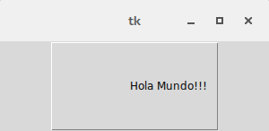

.. _option-anchor-sw:

SW
^^

Posiciona el texto/imagen en la esquina inferior izquierda del widget

.. code-block:: python

    boton = tk.Button(root, text="Hola Mundo!!!", width=20, height=10, anchor="sw")

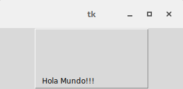

.. _option-anchor-s:

S
^

Posiciona el texto/imagen en la parte inferior del widget

.. code-block:: python

    boton = tk.Button(root, text="Hola Mundo!!!", width=20, height=10, anchor="s")

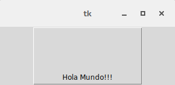

.. _option-anchor-se:

SE
^^

Posiciona el texto/imagen en la esquina inferior derecha del widget

.. code-block:: python

    boton = tk.Button(root, text="Hola Mundo!!!", width=20, height=10, anchor="se")

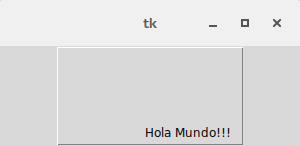
