.. _options:

Opciones
========

Muchos de los widgets que utilizamos y vimos hasta ahora cuentan con opciones, con el fin de no repetir la descripcion
de cada uno de ellos seran vistos uno a uno en esta seccion. Esta seccion no es mas que una traduccion de la
documentacion oficial de Tk sobre la libreria Tkinter con ejemplos e imagenes.

.. todo:: Enlazar con seccion para los colores

.. note::

    Para mas informacion sobre los colores visite la seccion "Colores" que se ve en

Pueden encontrar mas informacion desde la documentacion oficial de Tcl/Tk sobre las opciones estandar
`http://www.tcl.tk/man/tcl8.5/TkCmd/options.htm <http://www.tcl.tk/man/tcl8.5/TkCmd/options.htm>`_

.. todo:: Especificar widgets afectados por cada opcion (Ver formato de impresion)

.. _option-activebackground:

activebackground
----------------

Con esta opcion podemos indicar que color de fondo se debera utilizar cuando el cursor del mouse se posicione sobre el
widget. Para algunos elementos y en algunas plataformas solo sera visible cuando se hace click sobre el.

Acepta cualquier color en un formato valido para Tk, ver en seccion "Colores"

.. code-block:: python

    boton = Tkinter.Button(root, text="Hola Mundo!!!", activebackground="#F50743")
    boton.pack()

.. figure:: img/activebackground/basic_activebackground.png
    :alt: Ejemplo basico de activebackground
    :align: left

    Ejemplo sin el cursor encima

.. figure:: img/activebackground/basic_activebackground_oncursor.png
    :alt: Ejemplo basico de activebackground
    :align: right

    Ejemplo con el cursor encima

    Se muestra con color '#F50743' (Rojo)

.. _option-activeforeground:

activeforeground
----------------

Al igual que pasa con 'activebackground' con esta otra opcion podemos especificar el color en este caso de primer plano
del widget cuando se posiciona el cursor sobre este.

.. code-block:: python

    boton = tk.Button(root, text="Hola Mundo!!!", activeforeground="#F50743")

.. figure:: img/activeforeground/basic_activeforeground.png
    :alt: Ejemplo basico de activeforeground
    :align: left

    Ejemplo sin el cursor encima

.. figure:: img/activeforeground/basic_activeforeground_oncursor.png
    :alt: Ejemplo basico de activeforeground
    :align: right

    Ejemplo con el cursor encima

    Se muestra con color '#F50743' (Rojo)

.. _option-anchor:

anchor
------

Tkinter nos permite controlar de que forma se va a posicionar un texto o imagen con respecto al widget en el que se
encuentra. La opcion por defecto es 'CENTER' que muestra el elemento centrado.

  +----+----------+-------+
  | NW |  N       |    NE |
  +----+----------+-------+
  | W  |  CENTER  |    E  |
  +----+----------+-------+
  | SW |  S       |    SE |
  +----+----------+-------+

.. _option-anchor-nw:

NW
^^

Posiciona el texto/imagen en la esquina superior izquierda del widget

.. code-block:: python

    boton = tk.Button(root, text="Hola Mundo!!!", width=20, height=10, anchor="nw")

.. image:: img/anchor/anchor_nw.png
    :alt: Ejemplo anchor="nw"
    :align: center

.. _option-anchor-n:

N
^

Posiciona el texto/imagen en la parte superior del widget

.. code-block:: python

    boton = tk.Button(root, text="Hola Mundo!!!", width=20, height=10, anchor="n")

.. image:: img/anchor/anchor_n.png
    :alt: Ejemplo anchor="n"
    :align: center

.. _option-anchor-ne:

NE
^^

Posiciona el texto/imagen en la esquina superior derecha del widget

.. code-block:: python

    boton = tk.Button(root, text="Hola Mundo!!!", width=20, height=10, anchor="ne")

.. image:: img/anchor/anchor_ne.png
    :alt: Ejemplo anchor="ne"
    :align: center

.. _option-anchor-w:

W
^

Posiciona el texto/imagen en la parte izquierda del widget

.. code-block:: python

    boton = tk.Button(root, text="Hola Mundo!!!", width=20, height=10, anchor="w")

.. image:: img/anchor/anchor_w.png
    :alt: Ejemplo anchor="w"
    :align: center

.. _option-anchor-center:

CENTER
^^^^^^

Posiciona el texto/imagen en el centro del widget

.. code-block:: python

    boton = tk.Button(root, text="Hola Mundo!!!", width=20, height=10, anchor="center")

.. image:: img/anchor/anchor_center.png
    :alt: Ejemplo anchor="center"
    :align: center

.. _option-anchor-e:

E
^

Posiciona el texto/imagen en la parte derecha del widget

.. code-block:: python

    boton = tk.Button(root, text="Hola Mundo!!!", width=20, height=10, anchor="e")

.. image:: img/anchor/anchor_e.png
    :alt: Ejemplo anchor="e"
    :align: center

.. _option-anchor-sw:

SW
^^

Posiciona el texto/imagen en la esquina inferior izquierda del widget

.. code-block:: python

    boton = tk.Button(root, text="Hola Mundo!!!", width=20, height=10, anchor="sw")

.. image:: img/anchor/anchor_sw.png
    :alt: Ejemplo anchor="sw"
    :align: center

.. _option-anchor-s:

S
^

Posiciona el texto/imagen en la parte inferior del widget

.. code-block:: python

    boton = tk.Button(root, text="Hola Mundo!!!", width=20, height=10, anchor="s")

.. image:: img/anchor/anchor_s.png
    :alt: Ejemplo anchor="s"
    :align: center

.. _option-anchor-se:

SE
^^

Posiciona el texto/imagen en la esquina inferior derecha del widget

.. code-block:: python

    boton = tk.Button(root, text="Hola Mundo!!!", width=20, height=10, anchor="se")

.. image:: img/anchor/anchor_se.png
    :alt: Ejemplo anchor="se"
    :align: center

.. _option-background:

background (bg)
---------------

Sirve para indicar el color de fondo que tendra en area del widget cuando este se encuentre inactivo. Tambien se puede
utilizar su forma abreviada 'bg' como podemos ver en el segundo ejemplo.

.. code-block:: python

    boton = tk.Button(root, text="Hola Mundo!!!", background="#38EB5C")

.. code-block:: python

    boton = tk.Button(root, text="Hola Mundo!!!", bg="#38EB5C")

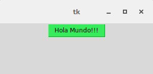

    Vemos el color verde que toma el boton

.. _option-bitmap:

bitmap
------

.. todo:: Ampliar documentacion

.. code-block:: python

    boton_error = tk.Label(root, bitmap="error").pack()
    boton_gray75 = tk.Label(root, bitmap="gray75").pack()
    boton_gray50 = tk.Label(root, bitmap="gray50").pack()
    boton_gray25 = tk.Label(root, bitmap="gray25").pack()
    boton_gray12 = tk.Label(root, bitmap="gray12").pack()
    boton_hourglass = tk.Label(root, bitmap="hourglass").pack()
    boton_info = tk.Label(root, bitmap="info").pack()
    boton_questhead = tk.Label(root, bitmap="questhead").pack()
    boton_question = tk.Label(root, bitmap="question").pack()
    boton_warning = tk.Label(root, bitmap="warning").pack()

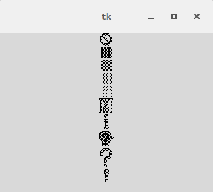

    Muestra de los bitmaps predefinidos

.. _option-borderwidth:

borderwidth (bd)
----------------

Nos da la posibilidad de especificar el ancho del borde del elemento con el que estemos trabajando, Tkinter nos permite
especificar el valor en varias unidades de medida (centimetros, pulgadas, milimetros y puntos) las cuales seran vistas
mas adelante en la guia. Si no se utiliza junto con la opcion 'relief' visualmente es similar a utilizar las opciones
'heigth' y 'width' como se puede observar en el ejemplo. El valor por defecto es de 1 pixel.

.. code-block:: python

    boton = tk.Button(root, text="Hola Mundo!!!", borderwidth=15)

.. code-block:: python

    boton = tk.Button(root, text="Hola Mundo!!!", bd=15)

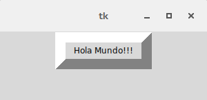

    Un boton con un borde de 15 pixeles

.. _option-command:

command
-------

Como ya lo mencionamos cuando vimos al widget Button este permite indicar la funcion o metodo que queremos que se llame
cuando se preciona por ejemplo un boton, pero esta opcion tambien funciona con otros widgets de Tkinter cumpliendo la
misma funcion.

.. code-block:: bash

    >>> def callback():
    >>>     print("Excelente")

    >>> boton = tk.Button(root, text="Que te parece la guia?", command=callback)
    'Excelente'

.. _option-cursor:

cursor
------

.. todo:: Crear seccion y enlazar

Nos da la posiblidad de indicar que cursor queremos que se muestre cuando el mouse se posiciona sobre la etiqueta.
En el siguiente enlace podremos encontrar una lista con los cursores disponibles en Tkinter
`http://www.tcl.tk/man/tcl8.5/TkCmd/cursors.htm <http://www.tcl.tk/man/tcl8.5/TkCmd/cursors.htm>`_ (Ver seccion "Anexos"
para ver el listado completo).

El valor 'none' consigue eliminar el cursor cuando se pasa el cursor sobre el widget.

.. code-block:: python

  etiqueta = tk.Label(root, text="Que te parece la guia?", cursor="hand1")

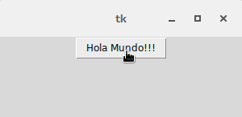

    Mostrando una mano a diferencia del cursor normal

.. _option-compound:

compound
--------

Especifica si el widget debe mostrar texto y mapas/imágenes al mismo tiempo, y si es así, donde el mapa de bits o imagen
debe estar en relación con el texto. Debe ser uno de los valores "none", "bottom", "top", "left", "right", o "center".
Por ejemplo, el valor (predeterminado) "none" especifica que el mapa de bits o imagen (si se ha definido en el sistema)
se mostrará en lugar del texto, el valor "left" especifica que el mapa de bits o imagen se muestra a la izquierda del
texto y el valor "center" especifica que el mapa de bits o imagen debe aparecer en la parte superior del texto.

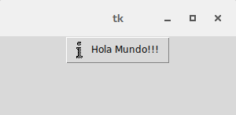

    Usando compound con el valor left

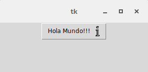

    Usando compound con el valor right

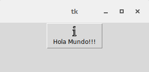

    Usando compound con el valor top

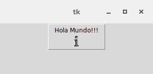

    Usando compound con el valor bottom

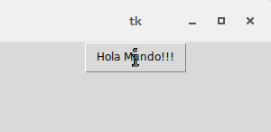

    Usando compound con el valor center

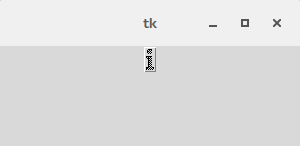

    Usando compound con el valor none

.. _option-default:

default
-------

.. todo:: Escribir documentacion (Opcion valida para Button)

.. _option-disabledbackground:

disabledbackground
------------------

.. todo:: Escribir documentacion (Opcion valida para Spinbox)

.. _option-disabledforeground:

disabledforeground
------------------

Funciona de la misma forma que foreground y activeforeground pero para elementos deshabilitados, se le puede pasar
cualquier color en un formato valido, si no se le pasa una cadena vacia el color que se mostrara sera el de la opcion
foreground pero con un efecto punteado.

El valor por defecto es *None* y obtiene el color del sistema.

.. code-block:: python

    boton = tk.Button(root, text="Hola Mundo!!!", state="disabled", disabledforeground=None)

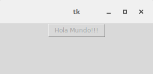

    Usando disabledforeground con el color por defecto

.. code-block:: python

    boton = tk.Button(root, text="Hola Mundo!!!", state="disabled", disabledforeground="#F50743")

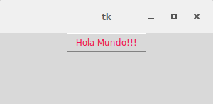

    Usando disabledforeground con un color rojo

.. code-block:: python

    boton = tk.Button(root, text="Hola Mundo!!!", state="disabled", disabledforeground="")

.. figure:: img/disabledforeground/disabledforeground_without_value.png
    :alt: disabledforeground sin valor
    :align: center

    Usando disabledforeground sin darle ningun valor

.. _option-exportselection:

exportselection
---------------

.. todo: Escribir documentacion

.. _option-font:

font
----

.. _option-foreground:

foreground (fg)
---------------

.. todo::

    * Enlazar Label y Entry con sus secciones
    * Ver ejemplos para widgets especificos
    * Mejorar descripcion

Si deseamos cambiar el color de primer plano usamos foreground, para explicarlo un poco mejor asi como vimos background
para determinar el color de fondo del widget tambien podemos cambiar el color de la parte delantera. Por lo general por
ejemplo en Label y Entry el color de foreground modifica el color de la fuente. Este color es mostrado en el estado
normal del widget, completando el circulo de estados ya vistos (normal, activo y desactivado).

Permite usar la abreviatura **fg** como habiamos visto para *background*.

.. code-block:: python

    boton = Tkinter.Button(root, text="Hola Mundo!!!", command=funcion, foreground="#38EB5C")

.. code-block:: python

    boton = Tkinter.Button(root, text="Hola Mundo!!!", command=funcion, fg="#38EB5C")

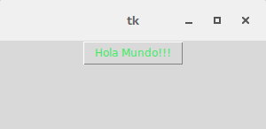

    Mostrando una fuente verde con foreground
