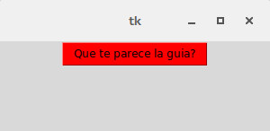
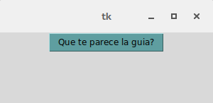
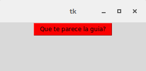

Colores
=======

Todos los widgets estándar de Tkinter proporcionan un conjunto básico de opciones para poder personalizarlos, que nos
permiten modificar sus colores, fuentes, bordes y tamaños entre otros. La mayoría de ellos permite especificar un color
de fondo y de primer plano que nos serán muy útiles cuando intentemos darle un aspecto mas pulido a nuestra aplicación.

Para especificar dichos colores tenemos dos formas, una es utilizar el nombre del color y la otra consiste en
especificar la proporción de rojo, verde y azul que componen a dicho color en dígitos hexadecimales que es la forma mas
popular y la mas precisa a la hora de trabajar.

Nombres de colores
------------------

Como se había mencionado se puede especificar un color con solo usar su nombre en ingles, por ejemplo para el color
blanco usaríamos la palabra 'white' y para el color rojo 'red', aunque Tkinter no nos limita a usar solamente los
colores básicos sino que nos ofrece una paleta bastante amplia de colores.

Les dejo dos ejemplos para que puedan observarlo en funcionamiento:

.. code-block:: python

    boton = tk.Button(root, text="Que te parece la guia?", background="red")

.. code-block:: python

    boton = tk.Button(root, text="Que te parece la guia?", background="CadetBlue")

Otra de las posibilidades que tenemos es utilizar los colores del sistema para conseguir un aspecto mas acorde a la
plataforma con que estemos trabajando.

Podemos obtener una lista de los posibles colores que nos da Tcl/Tk en la siguiente pagina
[http://www.tcl.tk/man/tcl8.5/TkCmd/colors.htm] o también en los anexos de esta guía los podrán encontrar:

RGB Hexadecimal
---------------

Aunque este método sea un poco mas complicado en su uso, es mas preciso que el método que habíamos mencionado arriba. La
forma en que se utiliza es la siguiente:

#RRGGBB

Donde RR, GG y BB son representaciones hexadecimales de los colores rojo, verde y azul, respectivamente. Para formar un
color debemos en primer lugar elegir la intensidad que deseamos usar, especificando la cantidad de rojo, verde y azul en
una escala del 0 al 255.

Usando la siguiente linea desde la consola de Python podemos crear nuestros colores para Tkinter reemplazando los
valores de la tupla por los que deseamos utilizar:

.. code-block:: python

    color_rojo = "#%02x%02x%02x" % (255, 0, 0)

Su uso es muy simple, solo debemos usar la forma que habíamos visto cuando coloreamos usando los nombres pero ahora
deberemos reemplazar el nombre del color por su equivalente en el valor RBG Hexadecimal como en el siguiente ejemplo:

.. code-block:: python

    boton = Tkinter.Button(root, text="Que te parece la guia?", background="#FA0000")

Donde "#FA0000" es el equivalente a utilizar la cadena 'red' para indicar el nombre del color.

Si estan pensando, me recomiendan los colores hexadecimales pero como hago para saber las proporciones de colores a
utilizar, es facil existen innumerables paletas de colores en la web. Un buen recurso para comenzar es la Wikipedia

.. ifconfig:: language is "es"

    https://es.wikipedia.org/wiki/Colores_web

.. ifconfig:: language is "en"

    https://en.wikipedia.org/wiki/Web_colors
